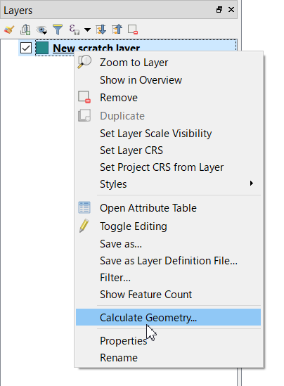

# Calculate Geometry

This plugin calculates the area of the polygon and the length of the line, in arbitrary units. Compared to using field calculator, you don't need to type calculation expressions and unit conversion factor, so you can get results with fewer steps.

## FAQ

### I do not see it appear on any menus. How do I action this plug-in?
It appears on the right click menu of vector layer in "Layers" panel.

